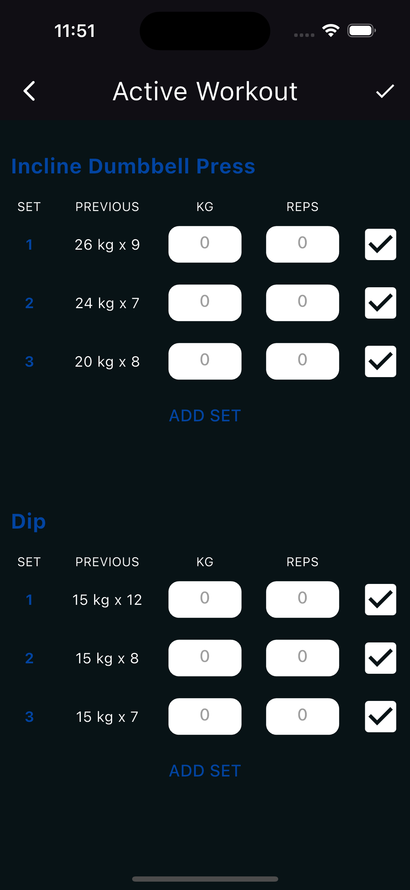

## Table of Contents

- [Story](#story)
- [About GymMetrics](#about-gymmetrics)
- [Features](#features)
- [Screenshots](#screenshots)
- [Installation](#installation)

## Story

I developed **GymMetrics** because I didn't want to pay for the premium subscription of a similar commercial app. So, I completely remade it from scratch according to my own taste. Now, I'm in sole control of my workout data.

## About GymMetrics

This app is designed to provide all the essential tools for tracking and managing workout routines, making it an ideal choice for gym enthusiasts. By using GymMetrics, you can monitor your progress, customize workout plans, and achieve your fitness goals for free.

## Features

- **Workout Plans**: Create, edit, and manage your workout plans.
- **Exercise Tracking**: Log your exercises, sets, and reps.
- **Progress Monitoring**: Visualize your progress with detailed charts and statistics.
- **Customizable Templates**: Use and customize workout templates to fit your needs.
- **Cross-Platform**: Available on Android and iOS. *(Note: The app is not available for download on iOS because I don't want to pay Apple a fortune.)*

## Screenshots

| History Screen | Workout Plans | Active Workout |
|----------------|---------------|----------------|
|  |  |  |

## Installation

To install the APK, download it from the link below and follow the instructions to install it on your Android device.

[Download GymMetrics APK](https://github.com/GruLox/gym-metrics/releases/download/v1.0.0-alpha/gym_metrics_v1.0.0-alpha.apk)