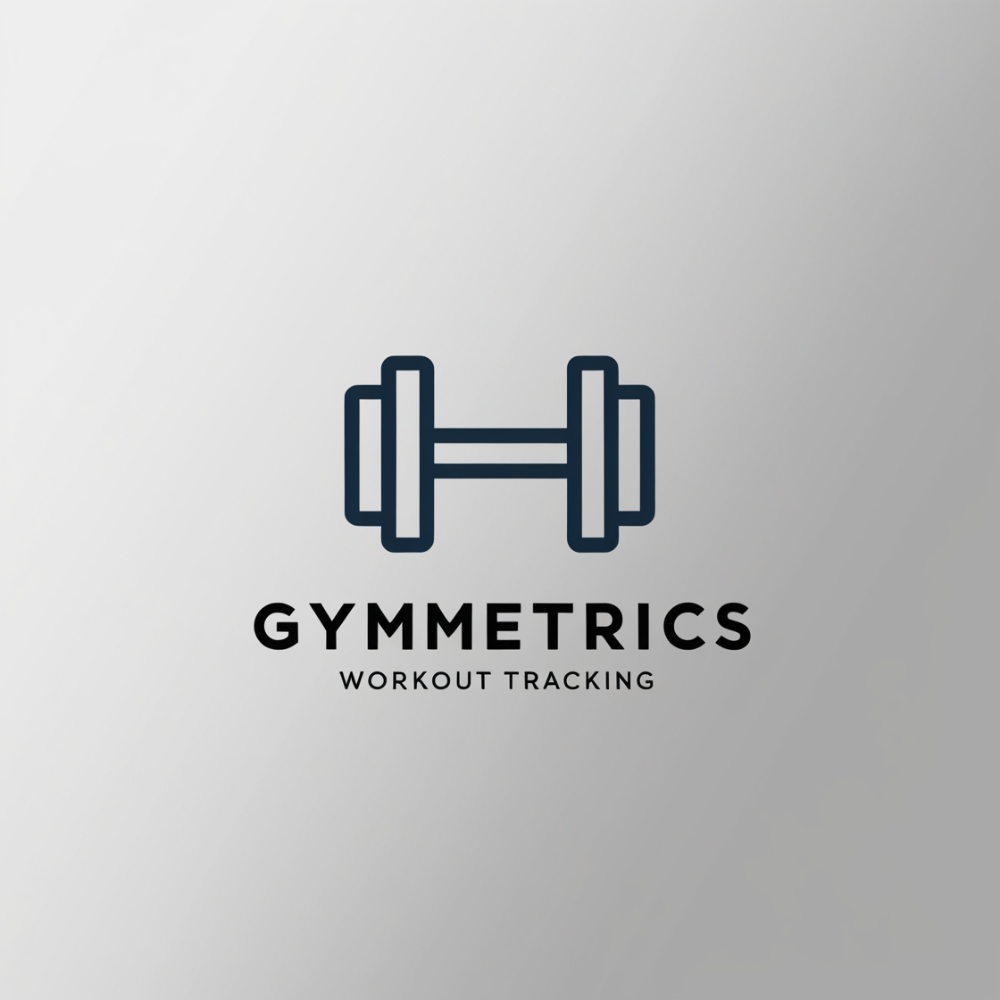
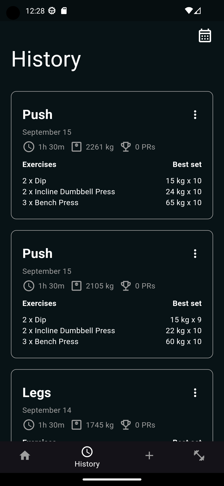
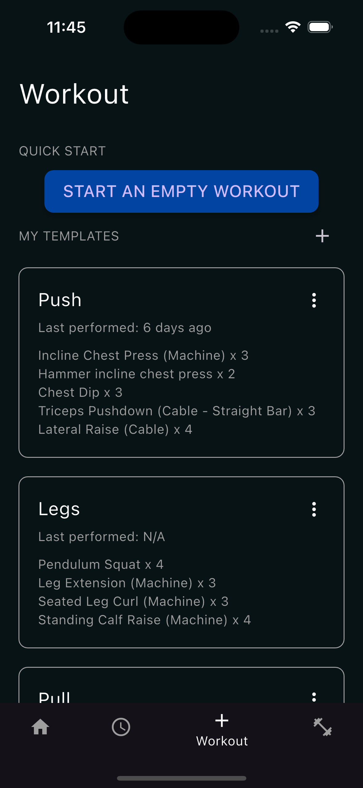

# GymMetrics



## Overview

**GymMetrics** is a comprehensive Flutter application designed to help you track and manage your workout routines. Whether you're a fitness enthusiast or a professional athlete, GymMetrics provides the tools you need to monitor your progress and achieve your fitness goals.

## Features

- **Workout Plans**: Create, edit, and manage your workout plans.
- **Exercise Tracking**: Log your exercises, sets, and reps.
- **Progress Monitoring**: Visualize your progress with detailed charts and statistics.
- **Customizable Templates**: Use and customize workout templates to fit your needs.
- **Cross-Platform**: Available on Android, iOS, Web, and Desktop.

## Screenshots

<div style="display: flex; flex-direction: row; justify-content: space-evenly;">
    
    
</div>

## Getting Started

### Prerequisites

- [Flutter SDK](https://flutter.dev/docs/get-started/install)
- [Android Studio](https://developer.android.com/studio) or [Xcode](https://developer.apple.com/xcode/) for mobile development
- [Visual Studio Code](https://code.visualstudio.com/) (recommended IDE)

### Installation

1. **Clone the repository:**

    ```sh
    git clone https://github.com/yourusername/gym_metrics.git
    cd gym_metrics
    ```

2. **Install dependencies:**

    ```sh
    flutter pub get
    ```

3. **Run the app:**

    ```sh
    flutter run
    ```
